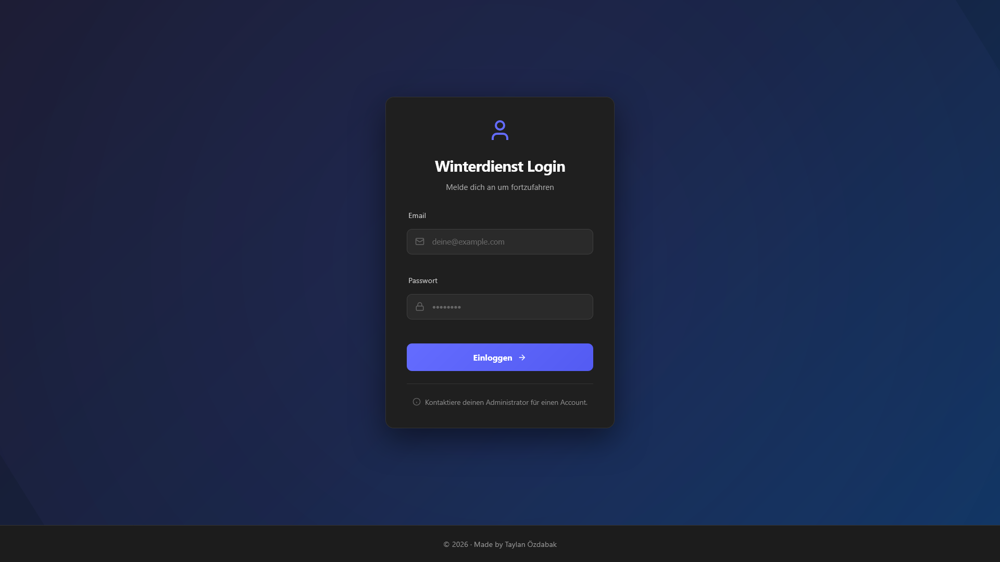
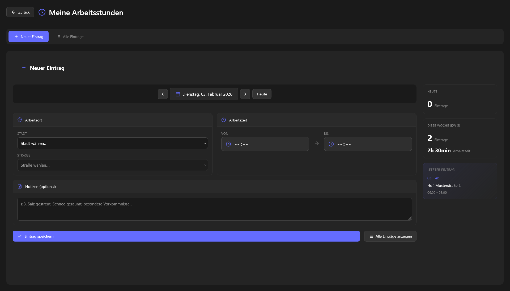
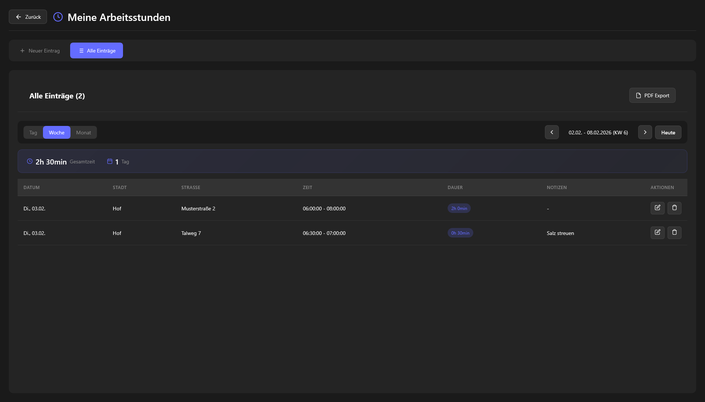
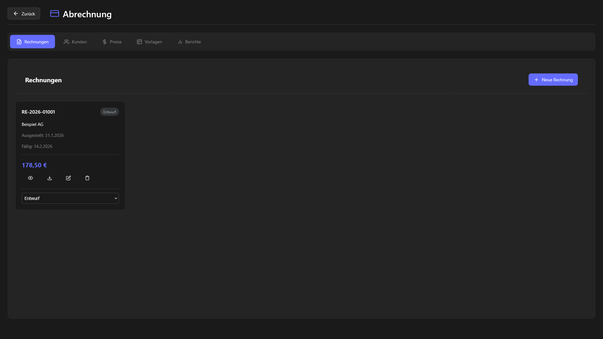
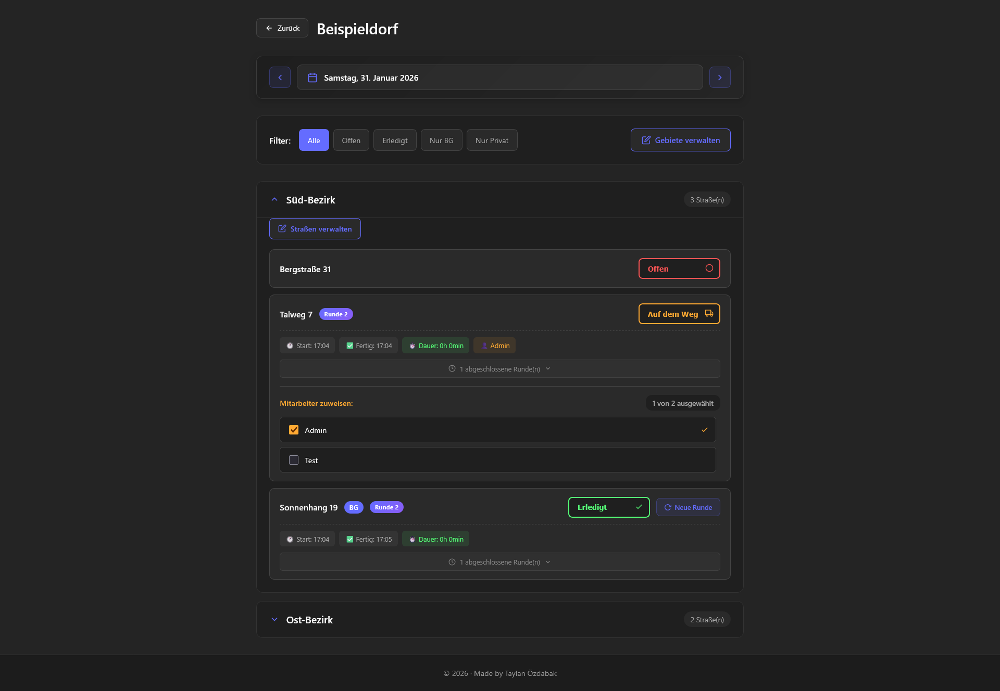

# Winterdienst Tracker

A modern web application for managing winter road maintenance services. Track street clearing operations, manage work schedules, generate invoices, and maintain comprehensive records for snow removal and de-icing services.

Was built to assist my dad in his work with the winter maintenance service in our city and is currently being used by him and his employees.

---

**Author:** [@Taylan474](https://github.com/Taylan474)  
**Version:** 1.0.0  
**License:** MIT

---

## Overview

Winterdienst Tracker is a full-stack application designed for winter maintenance service companies to efficiently manage their operations. The system provides real-time tracking of street clearing status, worker time logging, customer management, and automated invoice generation with PDF export capabilities.

Built with a focus on mobile-first design and offline resilience, the application ensures field workers can log their activities even in areas with poor connectivity.


---

## Features

### Street Management
- Organize streets by cities and geographic areas
- Track daily clearing status with multiple states per day
- Visual status indicators for quick overview
- Support for multiple status entries per street per day

### Work Time Tracking
- Log worker hours with automatic overtime calculation
- Weekly view with calendar week (Kalenderwoche) display
- Detailed work logs attached to specific streets
- Touch-friendly time picker for mobile devices

### Customer and Billing
- Customer database with contact information
- Customizable pricing structures per customer
- Automated invoice generation
- PDF export with professional formatting
- Invoice templates for recurring billing

### User Management
- Role-based access control (Admin, Worker roles)
- Granular permission system
- Secure authentication via Supabase Auth
- Password change enforcement for new users

### Reporting
- Generate reports for specific date ranges
- Export capabilities for record keeping
- Snapshot system for historical data preservation

### Technical Features
- Real-time data synchronization
- Offline-capable with data caching
- Responsive design for desktop and mobile
- Touch-optimized calendar and date inputs
- Connection status indicator

---

## Screenshots

### Landing Page



*Landing page showing all the cities and header dashboard* 

### Adding hours worked



*Field to add hours worked and in which street and for how long*

### Overview of hours worked



*An overview that shows how many hours an employee has worked. Has daily, weekly and monthly view options*

### Invoice Generation



*Invoice creation and management interface*

### Street View



*View of all the streets within the cities with all of their statuses*

> Additional screenshots available in the [docs/screenshots](docs/screenshots) directory

---

## Tech Stack

### Frontend
- **React 19** - UI library with latest features
- **TypeScript** - Type-safe development
- **Vite** - Fast build tool and development server
- **React Router 7** - Client-side routing

### Backend
- **Supabase** - Backend-as-a-Service
  - PostgreSQL database
  - Row Level Security (RLS) policies
  - Real-time subscriptions
  - Authentication

### Testing
- **Vitest** - Unit and integration testing
- **React Testing Library** - Component testing
- **jsdom** - DOM simulation

### Additional Libraries
- **jsPDF** - PDF generation
- **jspdf-autotable** - Table formatting for PDFs

---

## Installation

### Prerequisites

- Node.js 18.x or higher
- npm 9.x or higher
- Supabase account (for backend services)

### Setup

1. **Clone the repository**

```bash
git clone https://github.com/Taylan474/winter-service-manager.git
cd winterdienst-tracker
```

2. **Install dependencies**

```bash
npm install
```

3. **Configure environment variables**

Create a `.env` file in the project root:

```env
VITE_SUPABASE_URL=your_supabase_project_url
VITE_SUPABASE_ANON_KEY=your_supabase_anon_key
SUPABASE_SERVICE_ROLE_KEY=your_service_role_key
```

4. **Set up the database**

Apply migrations to your Supabase project:

```bash
npm run db:migrate
```

5. **Start the development server**

```bash
npm run dev
```

The application will be available at `http://localhost:5173`

### Production Build

```bash
npm run build
npm run preview
```

---

## Database Schema

The application uses a PostgreSQL database with the following core tables:

| Table | Description |
|-------|-------------|
| `cities` | Geographic cities/municipalities |
| `areas` | Sub-divisions within cities |
| `streets` | Individual streets to be serviced |
| `customers` | Customer information and contacts |
| `daily_street_status` | Daily status records for streets |
| `street_status_entries` | Multiple status updates per day |
| `work_logs` | Worker time entries |
| `pricing` | Pricing configurations |
| `invoices` | Generated invoices |
| `invoice_items` | Line items for invoices |
| `users` | Application users |
| `user_permissions` | Granular user permissions |

All tables include `created_at` and `updated_at` timestamps with automatic update triggers.

---

## Available Scripts

| Command | Description |
|---------|-------------|
| `npm run dev` | Start development server |
| `npm run build` | Build for production |
| `npm run preview` | Preview production build |
| `npm run lint` | Run ESLint |
| `npm run test` | Run unit tests |
| `npm run test:ui` | Run tests with UI |
| `npm run test:coverage` | Run tests with coverage report |
| `npm run test:integration` | Run integration tests |
| `npm run db:migrate` | Apply database migrations |
| `npm run db:migrate:status` | Check migration status |
| `npm run db:backup` | Create database backup |
| `npm run db:restore` | Restore from backup |

---

## Testing

The project includes comprehensive test coverage with over 300 tests:

### Unit Tests

Located in `__tests__` directories alongside source files:

**Component Tests:**
- DatePicker
- ForcePasswordChange
- Login
- Permissions
- StreetRow
- SuccessModal
- TouchTimePicker

**Library Tests:**
- Data cache functionality
- Locale configuration
- PDF generator
- Snapshot service

### Integration Tests

- Row Level Security (RLS) policy testing
- Snapshot service integration

### Running Tests

```bash
# Run all unit tests
npm run test

# Run with coverage
npm run test:coverage

# Run integration tests
npm run test:integration

# Interactive UI mode
npm run test:ui
```

---

## Project Structure

```
winterdienst-tracker/
|-- src/
|   |-- components/          # React components
|   |   |-- AreaManager.tsx
|   |   |-- CityManager.tsx
|   |   |-- CustomerManager.tsx
|   |   |-- DateInput.tsx
|   |   |-- DatePicker.tsx
|   |   |-- InvoiceManager.tsx
|   |   |-- PricingManager.tsx
|   |   |-- ReportManager.tsx
|   |   |-- StreetManager.tsx
|   |   |-- StreetRow.tsx
|   |   |-- TouchCalendar.tsx
|   |   |-- TouchTimePicker.tsx
|   |   |-- UsersManager.tsx
|   |   |-- WorkLogsModal.tsx
|   |   +-- __tests__/
|   |-- pages/               # Route components
|   |   |-- Billing.tsx
|   |   |-- Cities.tsx
|   |   |-- Login.tsx
|   |   |-- Streets.tsx
|   |   |-- WorkHours.tsx
|   |   +-- __tests__/
|   |-- lib/                 # Utilities and services
|   |   |-- auth.tsx
|   |   |-- data-cache.ts
|   |   |-- data-fetch.ts
|   |   |-- locale-config.ts
|   |   |-- pdf-generator.ts
|   |   |-- permissions.ts
|   |   |-- snapshot-service.ts
|   |   |-- supabase.ts
|   |   +-- __tests__/
|   |-- hooks/               # Custom React hooks
|   |-- styles/              # CSS stylesheets
|   |-- types/               # TypeScript type definitions
|   |-- App.tsx
|   +-- main.tsx
|-- supabase/
|   |-- migrations/          # Database migrations
|   |-- config.toml
|   +-- seed.sql
|-- scripts/                 # Utility scripts
|-- docs/                    # Documentation
|-- public/                  # Static assets
|-- package.json
|-- vite.config.ts
|-- vitest.config.ts
+-- tsconfig.json
```

---

## Configuration

### Vite Configuration

The project uses Vite for development and building. Configuration is in `vite.config.ts`.

### TypeScript Configuration

TypeScript is configured with strict mode enabled. See `tsconfig.json` for details.

### ESLint Configuration

Linting rules are defined in `eslint.config.js` with React-specific plugins.

---

## Deployment

### Vercel

The project includes `vercel.json` for easy deployment to Vercel:

1. Connect your GitHub repository to Vercel
2. Configure environment variables in Vercel dashboard
3. Deploy

### Docker

A `Dockerfile` and `docker-compose.yml` are provided for containerized deployment:

```bash
docker-compose up -d
```

---

## Environment Variables

| Variable | Description | Required |
|----------|-------------|----------|
| `VITE_SUPABASE_URL` | Supabase project URL | Yes |
| `VITE_SUPABASE_ANON_KEY` | Supabase anonymous key | Yes |
| `SUPABASE_SERVICE_ROLE_KEY` | Service role key for admin operations | Yes |

---

## License

This project is licensed under the MIT License. See the [LICENSE](LICENSE) file for details.

---

## Acknowledgments

- Built with [React](https://react.dev/)
- Backend powered by [Supabase](https://supabase.com/)
- PDF generation with [jsPDF](https://github.com/parallax/jsPDF)
